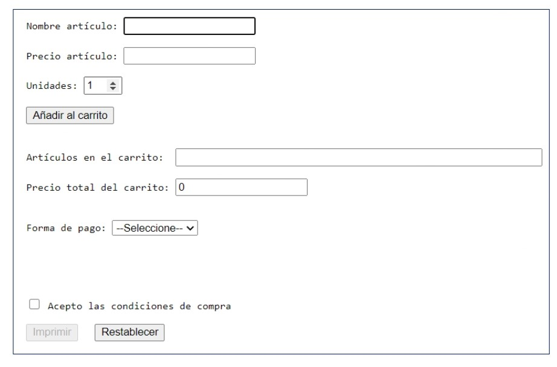
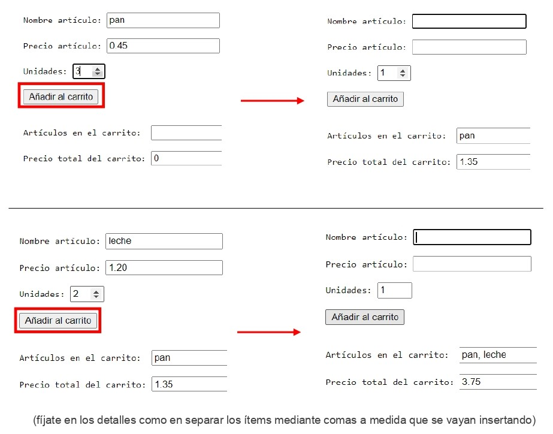
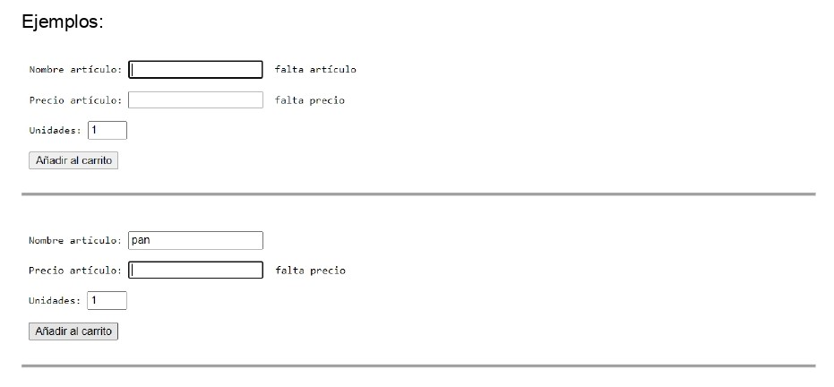
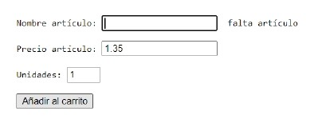
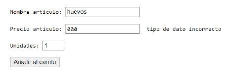
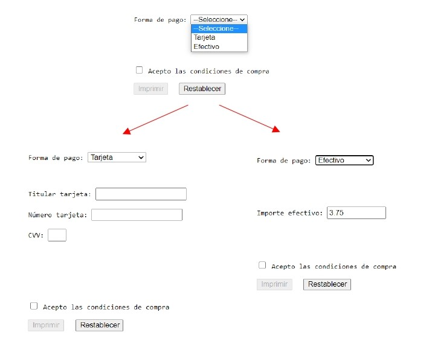
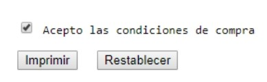
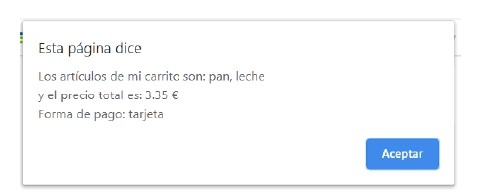
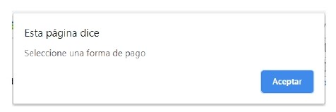

# AE-1. Carrito de la Compra

Crea una página web dinámica usando JavaScript que implemente las siguientes especificaciones:

- Constará de un formulario para recoger los artículos de un carrito de compra con los siguientes elementos:
  
  
  
- El botón “Añadir al carrito” debe tener la funcionalidad siguiente: cuando el usuario rellene las tres primeras cajas de texto (artículo, precio y unidades) y haga clic sobre dicho botón deberá sumar el precio del artículo por el número de unidades al “Precio total carrito” de los artículos anteriormente añadidos y el nombre del artículo deberá añadirse a “Artículos en el carrito” de modo que finalmente se puede ver la lista total de la compra con todos los productos y el precio total de dicha compra o carrito.

   Cada vez que se pulsa, además, se vuelven a resetear las tres primeras cajas para poder introducir un nuevo producto, el número de unidades será de 1 por defecto. La caja para el nombre del artículo recibe el foco para facilitar la entrada de datos.

  

- Sólo se podrán añadir ítems al carrito si se completan tanto el artículo como su precio. Si alguno de los dos faltase al hacer clic sobre el botón “Añadir al carrito”, se mostraría un texto al lado de la caja correspondiente advirtiéndolo, además se haría el foco de nuevo en la caja.

  Ejemplos:

  

  

- También es necesario validar el precio del artículo para que solo acepte datos numéricos, sino se advertirá de la misma forma que la anterior al hacer clic en el botón “Añadir al carrito”:

  

- Habrá dos formas de pagar:

  

- Si se selecciona “Tarjeta” aparecerán tres nuevas cajas de texto para introducir los datos de la tarjeta bancaria.

- Si se selecciona “Efectivo” aparecerá una nueva caja de texto con el importe total del carrito.

- El botón “Imprimir” se habilitará cuando se acepten las condiciones de compra.

  

- Cuando se pulse el botón “Imprimir” debe mostrar a través de una ventana, tanto la lista de la compra final como el precio final del carrito según muestra la siguiente imagen:

  

- Si no se ha seleccionado una forma de pago deberá aparecer el siguiente mensaje:

  

- Con el botón “Restablecer” se resetean todas las cajas de texto para poder introducir un nuevo producto. La caja para el nombre del artículo recibe el foco para facilitar la entrada de datos. Inicializa la caja “Precio total del carrito” a 0 para facilitar las operaciones aritméticas.

**Se pide:**

- Escribe el contenido html de la página web.

- Realiza toda la lógica del programa en un archivo js externo.

- Aplica estilos mediante una hoja css externa.

Se valorará una buena presentación de la página web, pero lo importante es la parte funcional de JavaScript.

Es fundamental que durante la ejecución de la aplicación web no se produzcan excepciones ni ningún tipo de error. Habrá que gestionarlos y tenerlos en cuenta desde el código. Probad con la introducción de diferentes tipos de datos o dejando las cajas vacías. En todo momento habrá que informar al usuario de las necesidades del programa.