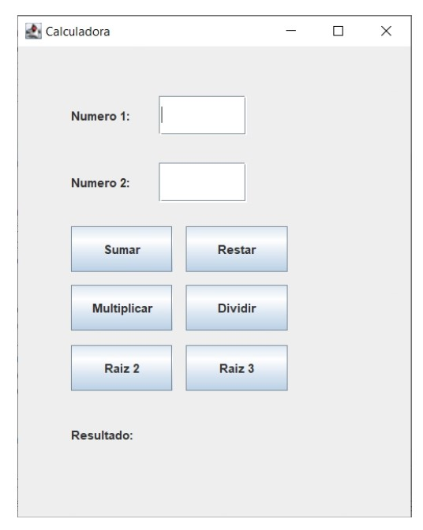
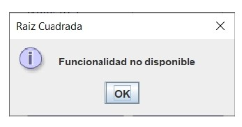
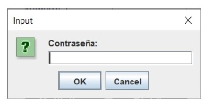
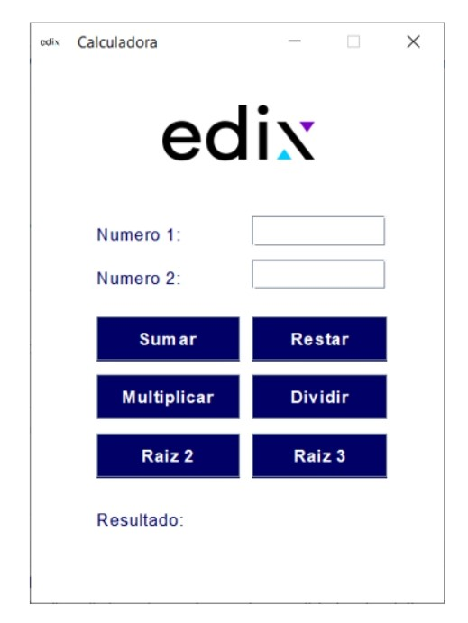

# AE-2. Calculadora

## Requerimiento 1
En este ejercicio vamos a crear una calculadora que realice las operaciones de sumar, restar, multiplicar, dividir dos números, raíz cuadrada y cúbica. De momento nos vamos a centrar en su funcionalidad, y el aspecto de nuestra calculadora será similar a este:

  

Aspectos a tener en cuenta:

- Es fundamental que durante la ejecución de la aplicación no se produzcan excepciones ni ningún tipo de error. Habrá que gestionarlos y tenerlos en cuenta desde el código. Probad con la introducción de diferentes tipos de datos o dejando las cajas vacías. En todo momento habrá que informar al asuario de las necesidades del programa.
  
- El cursor deberá aparecerá en la caja de texto del primer número para facilitar al usuario la entrada de los números.
  
- Al pulsar sobre el botón de “raíz cuadrada”, aparecerá una ventana con el mensaje “Funcionalidad no disponible”.
  
  

- Al pulsar sobre el botón de “raíz cúbica”, nos aparecerá un cuadro de diálogo que nos pedirá que introduzcamos una contraseña para poder acceder a esta funcionalidad. Si la contraseña es correcta se realizará la operación.

  

## Requerimiento 2
En esta parte vamos a mejorar la interfaz gráfica de nuestra calculadora, cuyo aspecto deberás camb

- Color/imagen de fondo.
- Cambiar el aspecto de los botones.
- Cambiar la tipografía que viene por defecto.
- Cambiar el icono de la aplicación y del ejecutable.

  
