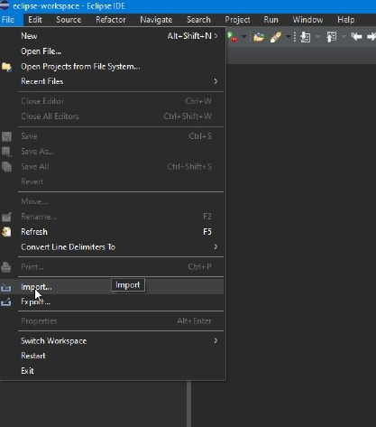
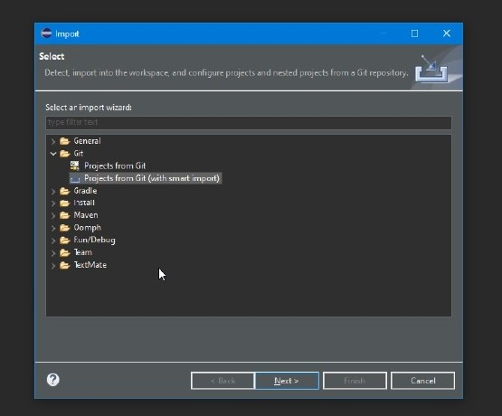
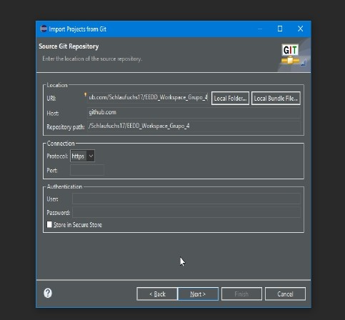
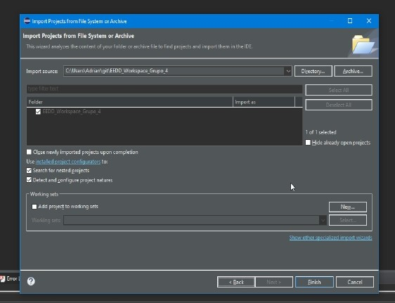

# AE-2. Control de versiones con GIT, GitHub e IDE.

## Grupo 04:
- Estanislao Callado Requena
- Adrián Caballero Fernández
- Miguel Borras Martín
# 

Este segundo ejercicio consistía en trabajar de forma remota en un repositorio común de GitHub en el que cada uno de nosotros se encargaba de uno de los métodos implementándolos en una clase 
principal y comprobando su funcionamiento.

Para este ejercicio se ha utilizado el código base del ejercicio anterior y se han implementado en la página de **GitHub** ambos ejercicios para centralizar el trabajo. 

Para poder trabajar primero con Eclipse se ha tenido que importar el repositorio primero.

*File/Import/Projects from Git (with smart import)/Clone url/*

Una vez importado en todos los IDE de los integrantes del grupo, cada uno se ha encargado de probar el código el su ordenador para comprobar si de forma individual se ejecutaba correctamente, para que después fuera implementado el el repositorio las llamadas de los objetos para que pudieran ser accedidos desde el archivo main que se ha creado para implementar las llamadas.

- **Adrián** ha sido el encargado de subir la base del repositorio común para su posterior edición,  de la creación del archivo main con las llamadas a los objetos propuestos en el *ejercicio 1* y de 
comprobar los que los métodos suma y producto eran ejecutados de forma correcta.

- **Estanislao** se ha encargado de revisar la clase main subida para que hiciera las llamadas correctamente, así como de incluir los enlaces *@see*, faltantes del ejercicio anterior. También se ha 
encargado editar el método resta y de cambiar algunas de los métodos y variables a *static*.

- **Miguel** se ha encargado de ejecutar el método cociente estableciendo los cambios oportunos y de revisar el código resultante para su correcto funcionamiento.

Durante la implementación del código en GitHub el mayor problema que nos hemos encontrado han sido errores a la hora de importar códigos desde GitHub a Eclipse para poder probarlo bien, llegando a la solución conjunta de importarlo con la opción de *import with smart import*, así como problemas menores debido al conflicto de nomenclatura de los archivos puesta por cada uno de nosotros, errores subsanados con una correcta identificación de los archivos. 

También se han añadido elementos que no se incluyeron en el Javadoc del ejercicio anterior para completar este ejercicio.
