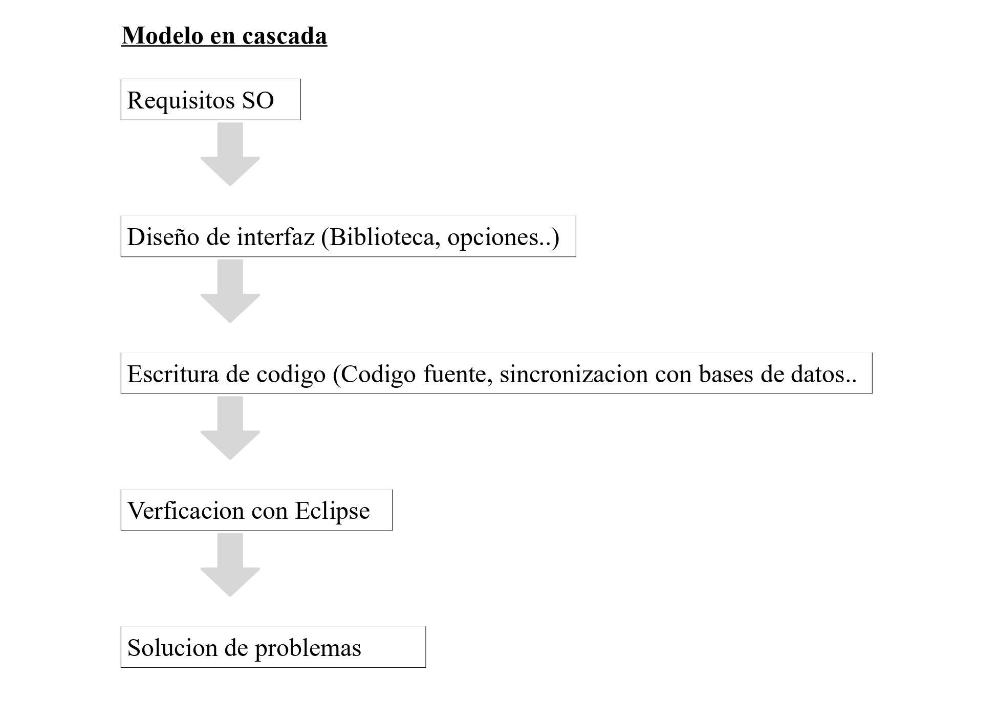
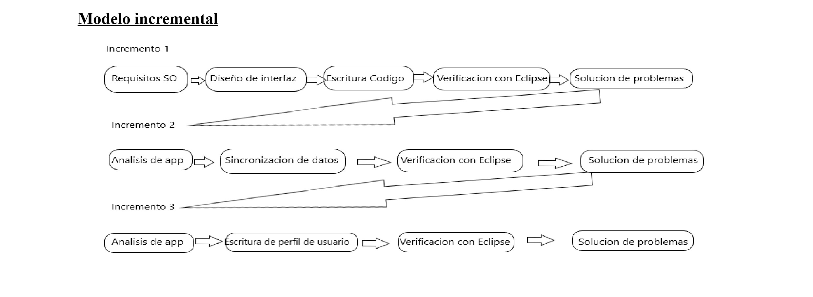
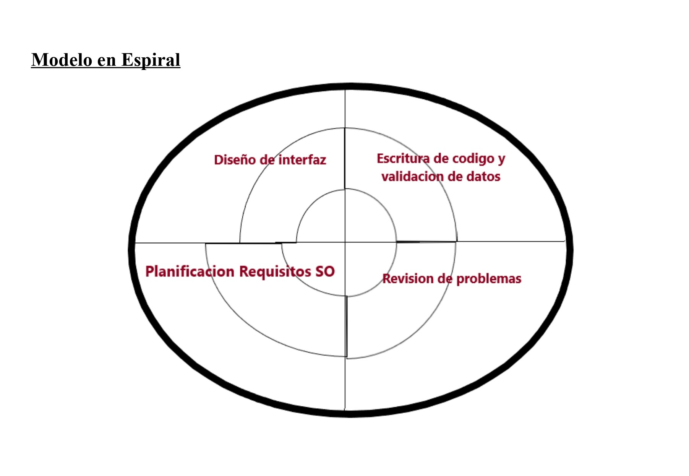

# Feedback 01 - Desarrollo del Software

**Teniendo de base que queremos crear un programa de 0, imaginemos ese programa y responde los siguientes casos prácticos.**

Bueno mi idea sería crear un programa en el que pudieras ir puntuando las películas al estilo de Filmaffinity pero con la opcion de por un lado comprarlas en tiendas (Amazon, Fnac..) y agregarlas a una filmoteca virtual en las que aparezcan las que poseemos.

Sería necesario establecer los requisitos minimos del sistema operativo, ya que se haría todo en el propio equipo, pero con posibilidad de sincronizacion con diversas bases de datos filmicas (IMDB), después diseñar la interfaz, con la biblioteca, opciones y perfil del usuario en la parte izquierda, el contenido agregado en la derecha y la zona de trabajo en la parte central. Después habría que
implementar el codigo del lenguaje de programacion, que pudiera ser capaz de mover grandes cantidades de datos para ir realizando pruebas en el entorno de desarrollo correspondiente (*Eclipse*, *Visual Estudio 2019*), y realizar el mantenimiento según vayan surgiendo errores, si los hay.

**- Crea el ciclo de vida en cascada de ese futuro programa.**

**- Crea el modelo incremental del mismo programa.**

**- Por ultimo crea el modelo en espiral.**

**- ¿Qué modelo te parece más seguro para crear la aplicación? ¿Cuál te parece más costoso de realizar?**

De los tres modelos de ciclo de vida creo que el más barato de implementar sería el ciclo de vida incremental, ya que sería el que iríamos poco a poco añadiendo datos nuevos para la aplicación, y el
más costoso sería el modelo en cascada, ya que si hubiera algun problema tendríamos que ir hasta el principio para solucionarlos, por lo que yo optaría para la creacion de esta aplicación por el modelo
incremental.

**- Por último, ¿qué tipo de lenguaje de programación utilizarías para la realización del programa? ¿Por qué?**

Para la escritura del lenguaje de programacion utilizaria un lenguaje interpretado de alto nivel como *Python*, ya que hay que manejar grandes cantidades de datos y cotejarlas con bases de datos.