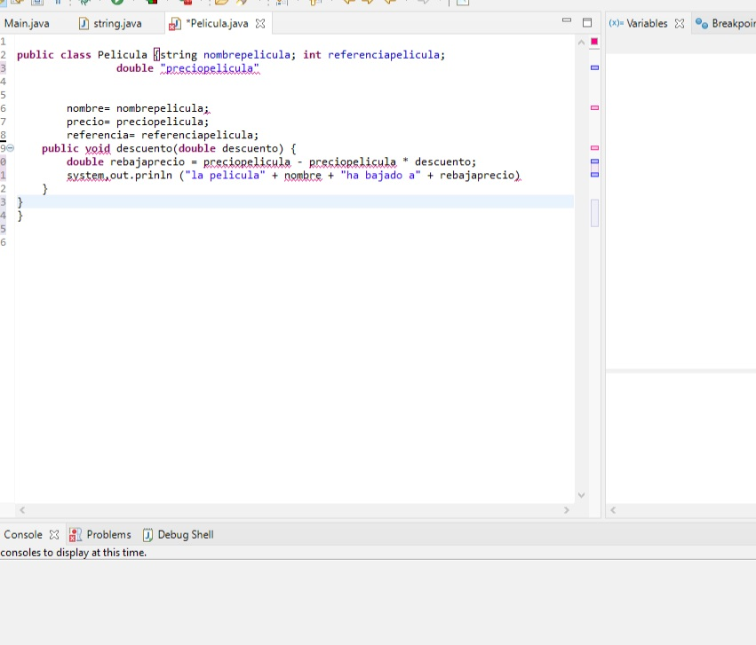
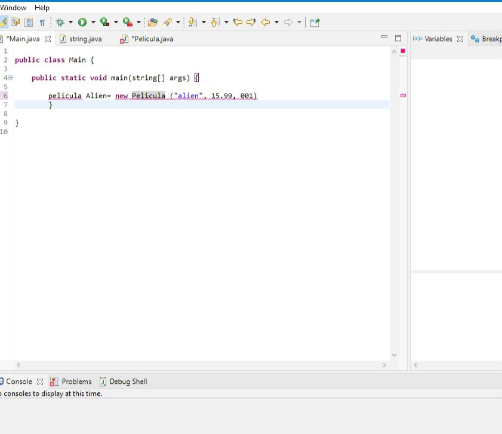
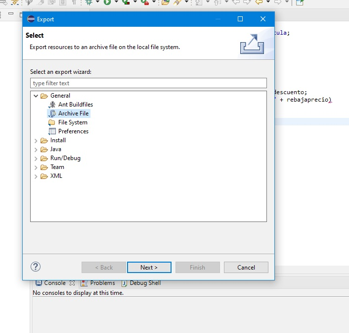
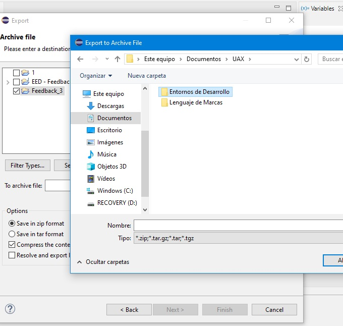

# Feedback 02 - Instalación y Uso de Entornos de Desarrollo

Durante la unidad hemos visto el uso del debugger en Eclipse centrándonos en sus puntos más importantes, por ello te proponemos
las siguientes cuestiones.

**- Genera un código en Eclipse y prueba el debugger colocándole varios puntos de interrupción a lo largo del código.**

Lo primero que hay que hacer es abrir *Eclipse* para generar un código con el lenguaje *Java*, en que crearemos dos clases, *Main* (la que ejecutará el programa) y *Película* (que tendra los atributos que usaremos, como titulo, referencia para buscar o el precio cuando la intentemos comprar).

Después he creado en *Main* la primera ficha de pelicula, que sería el producto con su precio y un número de referencia para poder identificarla.

Tras esto, ejecutamos el archivo y el modo *debug*, que permite la fiscalización durante la ejecución del programa, que a mi juicio es bastante útil, ya que podemos observar el valor de las variables en puntos concretos que queremos observar, sobre todo a la hora de buscar errores, ya que permite ir hasta diferentes puntos de ruptura o continuar en la siguiente linea de código.

Tras ello podemos poner un punto de ruptura (en este caso la *línea 10*), deteniéndose antes para calcular el valor del descuento y pulsamos *F8* para continuar con el programa para terminar la
ejecución.

**- ¿Qué te parece la herramienta debugger de Eclipse?**

Creo que es una herramienta bastante útil, ya que permite fiscalizar la ejecución del programa durante la misma, pudiendo observar así el valor que van tomando las variables que hemos formado a la hora de buscar errores.

**- Genera con el código creado hasta ahora un ejecutable *.jar*.**

Para crear un ejecutable *.jar* hay que pinchar con el botón derecho sobre el proyecto, seleccionar *export* y *runable jar file*, o bien *File/Export* para que se abra el menú contextual, y seleccionar
*runable Jar file* dentro del la carpeta *general* para ejecutarlo como *jar*.

**- Por último, exporta el archivo creado hasta ahora a una unidad externa.**

Para exportar el archivo a una unidad externa, el proceso es prácticamente el mismo que para crear un ejecutable *jar*, hay que seleccionar *export* y *archive file*, o bien *File/Export* para que se abra el menú contextual,y seleccionar *archive file* dentro del la carpeta *general*, y guardar el archivo en una carpeta del equipo a nuestra elección.

  

