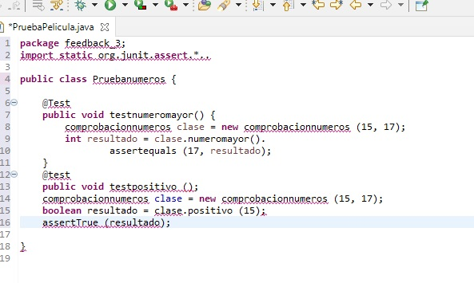
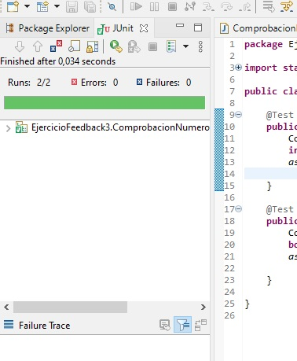

# Feedback 03 - Pruebas Unitarias

- **Abre un Entorno de Desarrollo (p.e. Eclipse) y genera una clase Java con el nombre que quieras, que tenga dos atributos y al menos dos métodos.**

- **Genera una clase de test para la clase del punto anterior y crea al menos un método de prueba para cada uno de los métodos de la clase original.**

- **Lanza la ejecución de todos los test unitarios creados e incluye en la respuesta del ejercicio, además del código creado, una captura de pantalla de dicha ejecución en la que se vea que el resultado de esos test es satisfactorio.**

