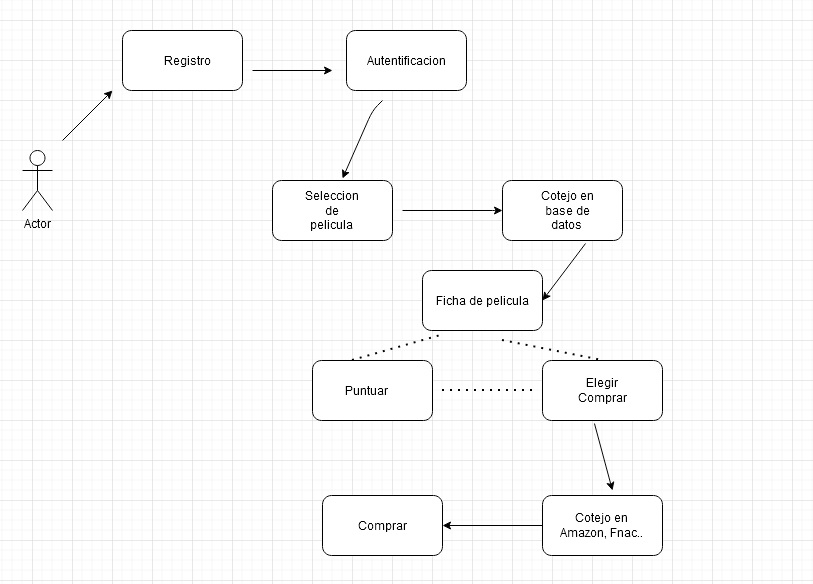

# Feedback 05 - Lenguaje UML y Creación de Diagramas

**Realiza las siguientes cuestiones prácticas sobre la unidad.**

- **Imagina que quieres hacer un programa y necesitas uno de los diagramas UML para comenzar. Elige uno de los tipos de diagramas existentes en UML y busca información sobre él. ¿Por qué has elegido ese diagrama?**

He reutilizado el programa propuesto en el *Feedback 01*, que consistía en una aplicación de cine, que permitía puntuar películas y/o comprar a través de plataformas externas, tras un cotejo en una
Base de datos.

He elegido un *diagrama UML de usos*, porque creo que es el que mejor puede representar el funcionamiento de la aplicación, por encima de otros diagramas como el de objetos o clases.

- **Crea un pequeño diagrama a mano que corresponda con el tipo de diagrama que has escogido. Explica sus elementos.**

 

El usuario se tiene que registrar en la página y validar sus datos de usuario mediante un sistema de autentificación. 

Tras ello tiene que buscar la película que desee puntuar o comprar, y al seleccionarla la palicación cotejará el título con una base de datos (IMDB, FilmAffinity) para mostrar la ficha, y ahí el usuario puede elegir tanto puntuar la película y comprarla después, como
comprarla directamente, que le redirigirá a páginas como Amazon o Fnac y allí podrá formalizar la compra.

- **Explica tus impresiones sobre lo realizado**

Creo que el diagrama de usos es bastante útil y sencillo para representar los pasos a seguir dentro de la página, aunque contra más pasos hay que realizar, mas enrevesado se puede convertir, aun
así me parece que es una buena herramienta para representar el mecanismo.

- **¿Realizarías otro programa futuro con este mismo diagrama utilizado? Si tu respuesta es positiva explica por qué.**

Aunque me gustaría realizar más diagramas como éste ya que creo que es bastante útil a la hora de reflejar los pasos de la aplicación, me gustaría más adelante conocer diagramas mas complejos que me permitan detallar con más exactitud los pasos a seguir.