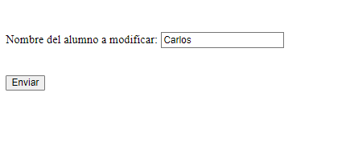
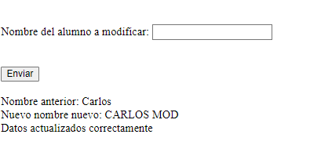

# Bases de Datos en PHP

Realizar un programa PHP (un único fichero) pero que contenga tres páginas: 

1. Que presente un formulario donde se introduzca el nombre del usuario que vamos a buscar en la tabla alumnospdo.

  

2. Donde se presente formulario con el nombre actual y en una caja de texto el nombre para ser modificado.

  

3. Página que indicará que se ha realizado correctamente la actualización.

  

**NOTA:** Realizarlo en tecnología PDO. 
