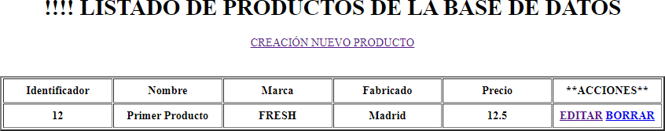
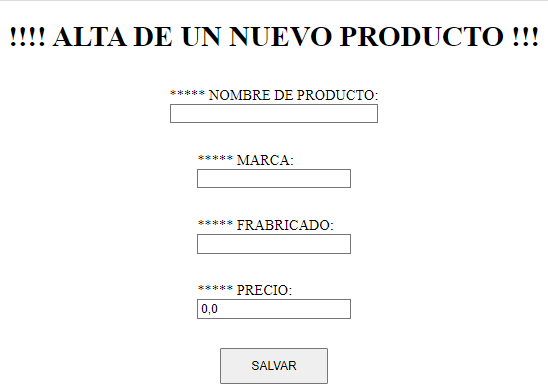
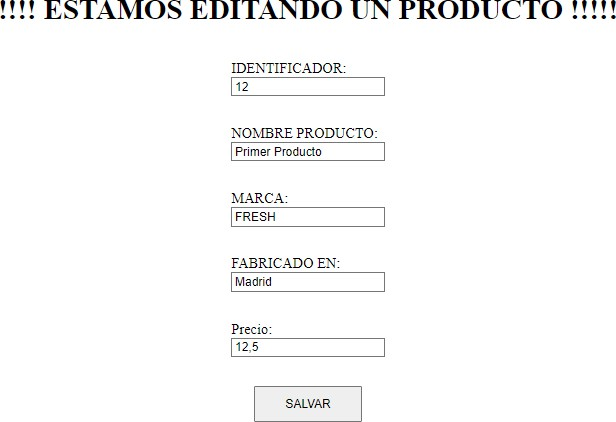

# Spring

Se trata de gestionar con Spring y MySQL una tabla de productos.
La tabla de productos tendrá los siguientes atributos/campos:
- Id que será un campo autogenerado por MySQL
- Nombre del producto
- Marca
- Fabricado en
- Precio
Cuando se arranque la aplicación, se presentará una página como sigue:

En el campo ACCIONES habrá un link para EDITAR los datos del producto y otro para BORRAR el producto.

El id del producto no se puede tocar por lo que será solamente de lectura ya que es auto-generado por la Base de datos.

Cuando pulsemos sobre el link de “Creación de producto nuevo”:

- Si pulsamos BORRAR: se borraría el producto.
- Si pulsamos EDITAR:
  

