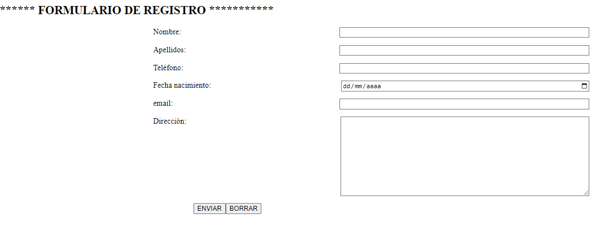
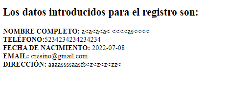

# Feedback 03 - Arrays y Formularios en PHP

Realizar un formulario (registro.html) que tenga el siguiente layout y composición: 

Todos los campos son obligatorios y deben de validarse antes de que se envíen los datos con el botón “ENVIAR”. 

- El botón “BORRAR” limpia todas las cajas de texto. 
- Email tendrá que tener el formato correcto, en otro caso no se podrá enviar la información. 
- Teléfono solamente admitirá números. 
  
Cuando los datos introducidos sean correctos y se pulse ENVIAR se mostrará la información de esta forma: 

El procesamiento y presentación de los datos se realizará mediante un programa llamado registro.php y los datos se enviarán vía POST. 

**NOTA:** Como se puede ver hay campos que admiten caracteres especiales y por tanto se tiene que contemplar. 
