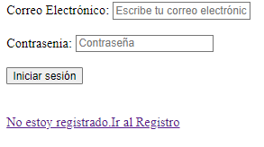
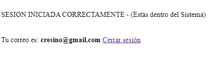
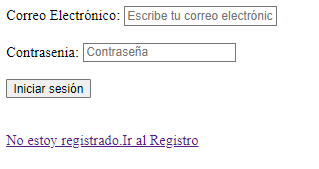
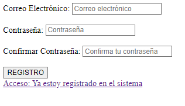
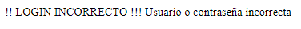

# Feedback 05 - PHP con Cookies y Sesiones

Este ejercicio parte de la base de datos y tabla creadas en el Ejercicio 3 anterior. 
El objetivo es introducir los datos de un usuario, para realizar un login a una aplicación y verificar que dichos datos se encuentran almacenados en una base de datos MySQL (la creada en el ejercicio 3) y en caso de que los credenciales existan crearla una sesión en la aplicación y por tanto que pueda acceder a las diferentes opciones. 

La aplicación tendrá una página en la que se muestre el id y el correo electrónico, pero dicha página estará protegida de forma que solamente podrán acceder aquellos usuarios que hayan iniciado una sesión. 
Cuando el usuario se quiera registrar inicialmente, tendrá un formulario como el que sigue: 

  

Si el usuario está registro, introducirá su correo y contraseña y el sistema verificará con la guardada en base de datos, si ambos valores son válidos entonces se creará una sesión para el usuario, donde se introducirá su correo electrónico y se enviará a una página secreta donde se le informe de que ha accedido al sistema y de cual es el correo electrónico con el que se ha logueado. 

  

Si el usuario pulsa sobre “Cerrar sesión” entonces el sistema le llevará a la página de inicial de login.

  

Si el usuario pulsa sobre el enlace “No estoy registrado. Ir al Registro” se le presentaría un formulario como el que sigue: 

  

Cuando el usuario rellene los datos y pulse REGISTRO, los datos se almacenarán en la BD y tablas creadas en el ejercicio anterior. 

Se usarán elementos de HTML5 por lo que se tendrá que verificar que el email es correcto en formato. 

Para la password en lugar de almacenarla en texto plano en la base de datos, que es poco profesional, se almacenará en HASH utilizando la función disponible en PHP: 

	function hashContrasenia($contrasenia) 
	{ 
		return password_hash($contrasenia, 			PASSWORD_BCRYPT); 
	} 

También para validar la password de BD con la introducida por el usuario, se podrá utilizar la siguiente función disponible en PHP: 

	function coincidenContrasenias($contrasenia, 	$contraseniaBD) 
	{ 
		return password_verify($contrasenia, 	$contraseniaBD); 
	} 

Cuando el usuario intenta acceder con el login y los datos no son correctos se mostraría un mensaje como el que sigue: 

  
